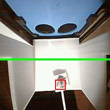

# Bumblebee Flight Tracking

Dieses Beispiel nimmt automatisch pro Sekunde zwei Bilder mit der Kamera auf, wendet das Bumblebee-Detektionsmodell darauf an, zählt die Ein- und Ausflüge und speichert das Bild mit den erkannten Ergebnissen (Bounding Boxen) auf der SD-Karte. Die Erkennung läuft dabei kontinuierlich, das Bild wird jeweils als JPEG abgelegt.



## Funktionsweise: Objekterkennung und Zählung

1. **Objekterkennung:**
	- Die Kamera nimmt kontinuierlich Bilder auf.
	- Jedes Bild wird durch ein KI-Modell (z. B. YOLO) analysiert.
	- Das Modell erkennt Hummeln und gibt für jedes erkannte Objekt eine Bounding Box mit den Koordinaten x1, y1, x2, y2 sowie eine Kategorie und einen Score (Wahrscheinlichkeit) zurück.
	- Beispiel-Log: `[category: 0, score: 0.88, x1: 265, y1: 110, x2: 471, y2: 388]`

2. **Zählung der Ein- und Ausflüge:**
	- Für jedes erkannte Objekt wird der Mittelpunkt der Bounding Box berechnet.
	- Es gibt eine definierte Linie (z. B. y = 120), die als Schwelle dient.
	- Die Software verfolgt, ob der Mittelpunkt eines Objekts diese Linie von oben nach unten (Einflug) oder von unten nach oben (Ausflug) überquert.
	- Bei jedem Überqueren wird der entsprechende Zähler erhöht:
	  - Einflug: Objekt bewegt sich von y < 120 nach y ≥ 120
	  - Ausflug: Objekt bewegt sich von y ≥ 120 nach y < 120
	- Die Zählung wird im Log ausgegeben, z. B.: `Einflüge: 4, Ausflüge: 1`

3. **Speichern der Ergebnisse:**
	- Das Bild mit den erkannten Bounding Boxen wird als JPEG auf der SD-Karte gespeichert.
	- Die Bounding Boxen werden visuell eingezeichnet.

**Zusammengefasst:**
Das System erkennt Hummeln im Bild, verfolgt deren Mittelpunkt und zählt, wie oft sie eine definierte Linie in die eine oder andere Richtung überqueren (Ein- und Ausflüge).

## Deployment

1. ESP-IDF installieren: [https://dl.espressif.com/dl/esp-idf/](https://dl.espressif.com/dl/esp-idf/)
2. In das Projektverzeichnis wechseln (Pfad anpassen):
	```
	cd C:\Users\nilsg\repos\BeeSense\hardware\firmware\bumblebee_detection\v2
	```
3. Target setzen (nur beim ersten build):
	```
	idf.py set-target esp32s3
	```
4. Firmware bauen:
	```
	idf.py build
	```
5. Flashen und Monitor starten (Port ggf. anpassen):
	```
	idf.py -p COM3 flash monitor
	```